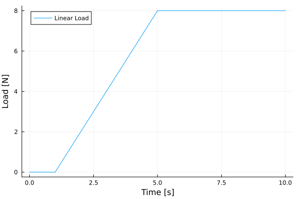
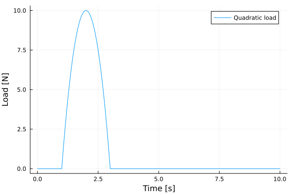

# Giffndof


[](https://github.com/CodeLenz/Giffndof.jl/actions/workflows/CI.yml?query=branch%3Amain)

# Generalized Integrating Factor for NDOFs

This repository contains the computer implementation of the solution procedures developed in **to be included** 
for solving coupled systems of second order ODEs with constant coefficients

 $M A(t) + C V(t) + K Y(t) = F(t)$

with initial conditions

 $Y(t_0) = U0$

and

 $V(t_0) = V0$

where $t$ is the independent variable, $Y(t)$ a $n \times 1$ vector (dependent variables), $V$ its first   derivative with respect to $t$ and $A$ its second derivative. Matrices  $M$, $C$ and $K$ are $n \times n$. Vector $F(t)$ is informed by using a dictionary.

As this package is not yet registered, you must install it by using

```julia
using Pkg
Pkg.add("https://github.com/CodeLenz/Giffndof.jl.git")
```

The OrderedDict data type of package OrderedCollections is needed to use this package. It can also be installed by using

```julia
using Pkg
Pkg.add("OrderedCollections")
```

The following methods are exported, depending on the type of excitation:

```julia
y, yh, yp = Solve_exponential(M,C,K,U0,V0,load_data,t0=t0)
```

```julia
y, yh, yp = Solve_polynomial(M,C,K,U0,V0,load_data,t0=t0)
```

```julia
y, yh, yp = Solve_dirac(M,C,K,U0,V0,load_data,t0=t0)
```

```julia
y, yh, yp = Solve_heaviside0(M,C,K,U0,V0,load_data,t0=t0)
```

```julia
y, yh, yp = Solve_heaviside1(M,C,K,U0,V0,load_data,t0=t0)
```

```julia
y, yh, yp = Solve_heaviside2(M,C,K,U0,V0,load_data,t0=t0)
```

where $y$ is the complete solution, $y_h$ the homogeneous solution and $y_p$ the permanent solution. Those solutions are functions and can be evaluated by simply passing a given time

```julia
y(0.1) 
```

for example.

A very efficient version is provided to compute the complete solution at a set of discrete times

```julia
response = Solve_discrete(M,C,K,times,load_data,U0,V0)
```

where ```load_data::Dict{Int64, Matrix{Union{String,Float64}}}``` will be explained in the examples.

There is a specific way of informing non null entries in $F(t)$ for each type of excitation. Examples to each one of the solution methods are provided in the following. Scripts to generate the plots of each example are avaliable in directory [examples](examples/) of this repository. A basic subroutine to compute the complete solution by using the Newmark-beta method is also provided

```julia
A,V,U,T = Solve_newmark(M::AbstractMatrix,C::AbstractMatrix,K::AbstractMatrix, f!::Function, 
                        ts::Tuple{Float64, Float64}, Δt::Float64; U0=Float64[], V0=Float64[], β=1/4, γ=1/2)
```

where $\mathbf{A}$, $\mathbf{V}$ and $\mathbf{U}$ are $n \times n_t$ matrices and $n_t$ is the number of time steps. $\mathbf{T}$ is a $n_t \times 1$ vector containing the discrete times. The method is used to validate the solutions of each example (dotted lines).

# Exponentials
<details>

For forces described as a series of exponentials

 $f_j(t) = \sum_{k=1}^{n_k} c_{jk} \exp(i \omega_{jk} t + i \phi_{jk})$

the user must inform the DOF $j$ as a key to a dictionary with entries given by (possible complex values) of $c_{jk}$, $\omega_{jk}$ and $\phi_{jk}$

```julia
    load_data = Dict{Int64,Vector{ComplexF64}}()
```

Lets consider the first example in the reference manuscript

## Example

Consider a $3$ DOFs problem subjected to a force

 $f_2(t) = 3 \sin(4t) = 3\frac{i}{2}(\exp(-4it) - \exp(4it))$

such that the (complex) amplitudes are $c_{21}=3i/2$ and $c_{22}=-3i/2$, the (complex) angular frequencies are $\omega_{21}=-4i$ and $\omega_{22}=4i$ and the (complex) phases are $\phi_{21}=0$ and $\phi_{22}=0$. Thus,

```julia
load_data[2] = [3*im/2; -4.0*im; 0.0*im ; -3*im/2; 4.0*im; 0.0*im]
```

The complete example is

```julia
using Giffndof
function Example_exponential(t0=0.0)

    # Mass matrix
    M = [2.0 0.0 0.0 ;
         0.0 2.0 0.0 ;
         0.0 0.0 1.0 ]

    # Stiffness matrix
    K = [6.0 -4.0  0.0 ;
        -4.0  6.0 -2.0 ;
         0.0 -2.0  6.0]*1E2

    # Damping matrix
    C = 1E-2*K

    # Initial Conditions
    U0  = [0.0; 0.0; 0.0]
    V0  = [0.0; 0.0; 0.0]

    #----------------------------- g_2(t) = 3*sin(4 t) -----------------------------#

    # Amplitude
    ampl = 3.0

    # Angular frequency
    ws = 4.0

    # Split the ampl*sin(ws t) into two exponentials

    # with complex amplitudes
    c_21 =  ampl*im/2
    c_22 = -ampl*im/2

    # complex angular frequencies
    w_21 = -ws*im
    w_22 =  ws*im

    # and complex phases
    p_21 = 0.0*im
    p_22 = 0.0*im

    # Create a dictionary. Each key corresponds to the DOF (j)
    # such that
    # load_data[j] = [c_j1; w_j1; p_j1....; c_jnk; w_jnk; p_jnk]
    # were nk is the number of exponentials used to represent the 
    # loading at DOF j
    #
    load_data = Dict{Int64,Vector{ComplexF64}}()

    # For our example, DOF=2 and we have two exponentials
    load_data[2] = [c_21; w_21; p_21; c_22; w_22; p_22]

    # Main function -> solve the problem
    y, yh, yp = Solve_exponential(M,C,K,U0,V0,load_data,t0=t0)

    # Return the solutions for any t
    return y, yh, yp
    
 end   
```

One can generate the visualization for $y(t)$

```julia
  using Plots
  function Generate_plot(tspan = (0.0, 10.0), dt=0.01)

    # Call the example
    y, yh, yp = Example_exponential()

    # Discrete times to make the plot
    tt = tspan[1]:dt:tspan[2]
      
    # Reshape to plot
    ndofs = size(y(0.0),1)
    yy = reshape([real(y(t))[k] for k=1:ndofs for t in tt],length(tt),ndofs)

    # Plot
    display(plot(tt,yy))

end
```

</details>

<p>&nbsp;</p>

# Polynomials
<details>
 
For forces described as a polynomial

 $f_j(t) = \sum_{k=0}^{n_k} c_{jk} (t-t_j)^k$

the user must inform the DOF $j$ as a key to a dictionary with entries given by of $c_{jk}$ and $t_j$

```julia
    load_data = Dict{Int64,Vector{Float64}}()
```

## Example

Consider a $3$ DOFs problem subjected to a force 

 $f_2(t) = 10 t - t^2$

such that $t_2=0$,  $c_{20}=0$,  $c_{21}=10$,  $c_{22}=-1$. Thus

```julia
load_data[2] = [0.0; 0.0; 10.0; -1.0]
```

The complete example is 

```julia
using Giffndof, OrderedCollections
function Example_polynomial(t0 = 0.0)

    # Mass matrix
    M = [2.0 0.0 0.0 ;
         0.0 2.0 0.0 ;
         0.0 0.0 1.0 ]

    # Stiffness matrix
    K = [6.0 -4.0  0.0 ;
        -4.0  6.0 -2.0 ;
         0.0 -2.0  6.0]*1E2

    # Damping matrix
    C = 1E-2*K

    # Initial Conditions
    U0  = [0.0; 0.0; 0.0]
    V0  = [0.0; 0.0; 0.0]

    # Loading
    load_data = OrderedDict{Int64,Vector{Float64}}()

    # 10t - t^2 at DOF 2
    #        DOF     t2   c20  c21    c22  
    load_data[2] = [0.0 ; 0.0; 10.0; -1.0]

    #  Main function -> solve the problem
    y, yh, yp = Solve_polynomial(M,C,K,U0,V0,load_data,t0=t0)

    # Return the solution
    return y, yh, yp

end

```

One can generate the visualization for $y(t)$

```julia
  using Plots  
  function Generate_plot(tspan = (0.0, 10.0), dt=0.01)

    # Call the example
    y, yh, yp = Example_polynomial()

    # Discrete times to make the plot
    tt = tspan[1]:dt:tspan[2]
      
    # Reshape to plot
    ndofs = size(y(0.0),1)
    yy = reshape([real(y(t))[k] for k=1:ndofs for t in tt],length(tt),ndofs)

    # Plot
    display(plot(tt,yy))

end
```
</details>

<p>&nbsp;</p>

 
# Unitary impulse (Dirac's delta)
<details>
 
For forces described as a series of unitary impulses

 $f_j(t) = \sum_{k=0}^{n_k} c_{jk} \delta(t-t_{jk})$

the user must inform the DOF $j$ as a key to a dictionary with entries given by of $c_{jk}$ and $t_{jk}$

```julia
    load_data = Dict{Int64,Vector{Float64}}()
```

## Example

Consider a $3$ DOFs problem subjected to two oposite unitary impulses at $t=1$ and $t=5$ s

 $f_2(t) = \delta(t-1) - \delta(t-5)$

such that $c_{20}=1.0$, $t_{20}=1$, $c_{21}=-1$ and $t_{21}=5.0$

```julia
load_data[2] = [1.0; 1.0; -1.0; 5.0]
```

The complete example is 

```julia
using Giffndof, OrderedCollections
function Example_dirac(t0 = 0.0)


    # Mass matrix
    M = [2.0 0.0 0.0 ;
         0.0 2.0 0.0 ;
         0.0 0.0 1.0 ]

    # Stiffness matrix
    K = [6.0 -4.0  0.0 ;
        -4.0  6.0 -2.0 ;
         0.0 -2.0  6.0]*1E2

    # Damping matrix
    C = 1E-2*K

    # Initial Conditions
    U0  = [0.0; 0.0; 0.0]
    V0  = [0.0; 0.0; 0.0]

    #
    # Loading 
    #
    # g_2(t) = delta(t-1) - delta(t-5)
    #
    load_data = OrderedDict{Int64,Vector{Float64}}()
    #
    #               c_20  t_20  c_21  t_21
    load_data[2] = [1.0 ; 1.0; -1.0 ; 5.0]

    #  Main function -> solve the problem
    y, yh, yp = Solve_dirac(M,C,K,U0,V0,load_data,t0=t0)

    # Return the solution
    return y, yh, yp

 end
```
One can generate the visualization for $y(t)$

```julia
  using Plots
  function Generate_plot()

    # Call the example
    y, yh, yp = Example_dirac()

    # Discrete times to make the plot
    tt = tspan[1]:dt:tspan[2]
      
    # Reshape to plot
    ndofs = size(y(0.0),1)
    yy = reshape([real(y(t))[k] for k=1:ndofs for t in tt],length(tt),ndofs)

    # Plot
    display(plot(tt,yy))

end
```
</details>


<p>&nbsp;</p>


# Zero order polynomials multiplied by Heavisides
<details>
 
For forces described as first order polynomials times heavisides

 $f_j(t) = \sum_{k=0}^{n_k} (c_{jk0}) H(t-t_{jk})$

the user must inform the DOF $j$ as a key to a dictionary with entries given by of $c_{jk*}$ and $t_{jk}$

```julia
    load_data = Dict{Int64,Vector{Float64}}()
```

## Example

Consider a $3$ DOFs problem subjected to two oposite unitary steps at $t=1$ and $t=5$ s

 $f_2(t) = H(t-1) - H(t-5)$

such that $c_{200}=1$, $t_{20}=1$, $c_{210}=-1$, $t_{21}=5$

```julia
load_data[2] = [1.0; 1.0; -1.0; 5.0]
```

The complete example is 

```julia
using Giffndof, OrderedCollections
function Example_heaviside0(t0 = 0.0)

    # Mass matrix
    M = [2.0 0.0 0.0 ;
         0.0 2.0 0.0 ;
         0.0 0.0 1.0 ]

    # Stiffness matrix
    K = [6.0 -4.0  0.0 ;
        -4.0  6.0 -2.0 ;
         0.0 -2.0  6.0]*1E2

    # Damping matrix
    C = 1E-2*K

    # Initial Conditions
    U0  = [0.0; 0.0; 0.0]
    V0  = [0.0; 0.0; 0.0]

    #
    # Loading (1 + 0*t) H(t-1) - (1 + 0*t)H(t-5)
    #
    load_data = OrderedDict{Int64,Vector{Float64}}()

    #   c_j00  t_jk .... c_j(nk)0  t_j(nk)
    load_data[2] = [1.0; 1.0 ; -1.0;  5.0 ]

    #  Main function -> solve the problem
    y, yh, yp = Solve_heaviside0(M,C,K,U0,V0,load_data,t0=t0)

    # Return the solution
    return y, yh, yp
    
 end
``` 

 One can generate the visualization for $y(t)$

```julia
  using Plots  
  function Generate_plot()

    # Call the example
    y, yh, yp = Example_heaviside0()

    # Discrete times to make the plot
    tt = tspan[1]:dt:tspan[2]
      
    # Reshape to plot
    ndofs = size(y(0.0),1)
    yy = reshape([real(y(t))[k] for k=1:ndofs for t in tt],length(tt),ndofs)

    # Plot
    display(plot(tt,yy))

end
```
</details>


<p>&nbsp;</p>


# First order polynomials multiplied by Heavisides
<details>
 
For forces described as first order polynomials times heavisides

 $f_j(t) = \sum_{k=0}^{n_k} (c_{jk0} + c_{jk1} t ) H(t-t_{jk})$

the user must inform the DOF $j$ as a key to a dictionary with entries given by of $c_{jk*}$ and $t_{jk}$

```julia
    load_data = Dict{Int64,Vector{Float64}}()
```

## Example

Consider a $3$ DOFs problem subjected to a linear ramp from $t=1$ to $t=5$ s and a constant value for $t>=5$.

 $f_2(t) = (-2+2t)*H(t-1) + (10-2t)*H(t-5)$



such that $c_{200}=-2$, $c_{201}=2$, $t_{20}=1$, $c_{210}=10$, $c_{211}=-2$, $t_{21}=5$

```julia
load_data[2] = [-2.0; 2.0; 1.0; 10.0; -2.0; 5.0]
```

The complete example is 

```julia
using Giffndof, OrderedCollections
function Example_heaviside1(t0 = 0.0)

    # Mass matrix
    M = [2.0 0.0 0.0 ;
         0.0 2.0 0.0 ;
         0.0 0.0 1.0 ]

    # Stiffness matrix
    K = [6.0 -4.0  0.0 ;
        -4.0  6.0 -2.0 ;
         0.0 -2.0  6.0]*1E2

    # Damping matrix
    C = 1E-2*K

    # Initial Conditions
    U0  = [0.0; 0.0; 0.0]
    V0  = [0.0; 0.0; 0.0]

    #
    # Loading (-2+2*t) H(t-1) + (10 - 2*t)H(t-5)
    #
    load_data = OrderedDict{Int64,Vector{Float64}}()

    #   c_j00 c_j01  t_jk .... c_j(nk)0 c_j(nk)1 t_j(nk)
    load_data[2] = [-2.0; 2.0; 1.0 ; 10.0; -2.0; 5.0 ]

    #  Main function -> solve the problem
    y, yh, yp = Solve_heaviside1(M,C,K,U0,V0,load_data,t0=t0)

    # Return the solution
    return y, yh, yp
    
 end
``` 

 One can generate the visualization for $y(t)$

```julia
  using Plots  
  function Generate_plot()

    # Call the example
    y, yh, yp = Example_heaviside1()

    # Discrete times to make the plot
    tt = tspan[1]:dt:tspan[2]
      
    # Reshape to plot
    ndofs = size(y(0.0),1)
    yy = reshape([real(y(t))[k] for k=1:ndofs for t in tt],length(tt),ndofs)

    # Plot
    display(plot(tt,yy))

end
```
</details>

<p>&nbsp;</p>

# Second order polynomials multiplied by Heavisides
<details>
 
For forces described as second order polynomials times heavisides

 $f_j(t) = \sum_{k=0}^{n_k} (c_{jk0} + c_{jk1} t + c_{jk2} t^2) H(t-t_{jk})$

the user must inform the DOF $j$ as a key to a dictionary with entries given by of $c_{jk*}$ and $t_{jk}$

```julia
    load_data = Dict{Int64,Vector{Float64}}()
```

## Example

Consider a $3$ DOFs problem subjected a "bump" between $t=1$ and $t=3$ s and zero elsewere.

 $f_2(t) = (-30 + 40t - 10t^2)H(t-1) + (30 - 40t + 10t^2)H(t-3)$



such that $c_{200}=-30$, $c_{201}=40$, $c_{202}=-10$, $t_{20}=1$, $c_{210}=30$, $c_{211}=-40$, $c_{212}=10$, $t_{21}=3$

```julia
load_data[2] = [-30.0; 40.0; -10.0; 1.0; 30.0; -40.0; 10.0; 3.0]
```

The complete example is 

```julia
using Giffndof, OrderedCollections
function Example_heaviside2(t0 = 0.0)

    # Mass matrix
    M = [2.0 0.0 0.0 ;
         0.0 2.0 0.0 ;
         0.0 0.0 1.0 ]

    # Stiffness matrix
    K = [6.0 -4.0  0.0 ;
        -4.0  6.0 -2.0 ;
         0.0 -2.0  6.0]*1E2

    # Damping matrix
    C = 1E-2*K

    # Initial Conditions
    U0  = [0.0; 0.0; 0.0]
    V0  = [0.0; 0.0; 0.0]

    #
    # Loading (-30 + 40*t - 10*t^2) H(t-1) + (30 - 40*t + 10*t^2)H(t-3)
    #
    load_data = OrderedDict{Int64,Vector{Float64}}()

    #   c_j00 c_j01 c_j02  t_jk .... c_j(nk)0 c_j(nk)1 c_j(nk)2 t_j(nk)
    load_data[2] = [-30.0; 40.0; -10.0; 1.0; 30.0; -40.0; 10.0; 3.0]
    
    #  Main function -> solve the problem
    y, yh, yp = Solve_heaviside2(M,C,K,U0,V0,load_data,t0=t0)

    # Return the solution
    return y, yh, yp
    
 end
``` 

 One can generate the visualization for $y(t)$

```julia
  using Plots  
  function Generate_plot(tspan = (0.0, 10.0), dt=0.01)

    # Call the example
    y, yh, yp = Example_heaviside2()

    # Discrete times to make the plot
    tt = tspan[1]:dt:tspan[2]
      
    # Reshape to plot
    ndofs = size(y(0.0),1)
    yy = reshape([real(y(t))[k] for k=1:ndofs for t in tt],length(tt),ndofs)

    # Plot
    display(plot(tt,yy))

end
```
</details>


<p>&nbsp;</p>

# Efficient Discrete solution
<details>

A special method is provided if the user just wants the response $\mathbf{y}$ at a discrete set of times. The user can specify different types of loading at the same time using a dictionary and mix exponentials, polynomials and Dirac's deltas at the same time. There are substancial differences when compared to the previous methods.

The load dictionary is given by

```julia
    load_data::Dict{Int64, Matrix{Union{String,Float64}}}
```

where the Int64 is the loaded DOF (key), and the string can be "sin", "cos", "dirac" or "polynomial".

The entries in the matrix depend on the type of excitation:

For "sin" and "cos" the entries are ```A f d``` where $A$ is an amplitude, $f$ is a frequency in Hz and $d$ is a phase in degrees.

```julia
using Giffndof
function Example_exponential()

    # Mass matrix
    M = [2.0 0.0 0.0 ;
         0.0 2.0 0.0 ;
         0.0 0.0 1.0 ]

    # Stiffness matrix
    K = [6.0 -4.0  0.0 ;
        -4.0  6.0 -2.0 ;
         0.0 -2.0  6.0]*1E2

    # Damping matrix
    C = 1E-2*K

    # Initial Conditions
    U0  = [0.0; 0.0; 0.0]
    V0  = [0.0; 0.0; 0.0]

    # Create the dictionary
    load_data = Dict{Int64,Matrix{Union{Float64,String}}}()

    # Apply a 3sin(4t) at the second dof    
    load_data[2] = ["sine" 3.0 (4.0/(2*pi)) 0.0]

    # Discrete times
    times = collect(range(start=0.0, stop=10.0, length=1000))

    # Evaluates the response using the Giffndof for discrete times
    response = real.(Solve_discrete(M, C, K, times, load_data, U0, V0))
    
 end   
```

For "polynomial" the entries are ```[c_k t_k k]``` where $k=0$ for the constant term, $k=1$ for the linear term and so on.

```julia
using Giffndof
function Example_polynomial()

    # Mass matrix
    M = [2.0 0.0 0.0 ;
         0.0 2.0 0.0 ;
         0.0 0.0 1.0 ]

    # Stiffness matrix
    K = [6.0 -4.0  0.0 ;
        -4.0  6.0 -2.0 ;
         0.0 -2.0  6.0]*1E2

    # Damping matrix
    C = 1E-2*K

    # Initial Conditions
    U0  = [0.0; 0.0; 0.0]
    V0  = [0.0; 0.0; 0.0]

    # Create the dictionary
    load_data = Dict{Int64,Matrix{Union{Float64,String}}}()

    # Apply the polynomial 10t - t^2, starting at t=0, to the second DOF
    load_data[2] = ["polynomial" 10.0 0.0 1.0;  
                    "polynomial" -1.0 0.0 2.0]

    # Discrete times
    times = collect(range(start=0.0, stop=10.0, length=1000))

    # Evaluates the response using the Giffndof for discrete times
    response = real.(Solve_discrete(M, C, K, times, load_data, U0, V0))
    
 end   
```

For "dirac" the entries are ```[A t 0]``` where $A$ is an amplitude and $t$ is the activation time. The last position is not used.

```julia
using Giffndof
function Example_dirac()

    # Mass matrix
    M = [2.0 0.0 0.0 ;
         0.0 2.0 0.0 ;
         0.0 0.0 1.0 ]

    # Stiffness matrix
    K = [6.0 -4.0  0.0 ;
        -4.0  6.0 -2.0 ;
         0.0 -2.0  6.0]*1E2

    # Damping matrix
    C = 1E-2*K

    # Initial Conditions
    U0  = [0.0; 0.0; 0.0]
    V0  = [0.0; 0.0; 0.0]

    # Create the dictionary
    load_data = Dict{Int64,Matrix{Union{Float64,String}}}()

    # Apply TWO Dirac's delta to the second DOF. A positive at 1s and 
    # a negative at 5s.
    load_data[2] = ["dirac" 1.0 1.0 0.0; "dirac" -1.0 5.0 0.0]

    # Discrete times
    times = collect(range(start=0.0, stop=10.0, length=1000))

    # Evaluates the response using the Giffndof for discrete times
    response = real.(Solve_discrete(M, C, K, times, load_data, U0, V0))
        
 end   
```

On is not constrained to impose a single type of excitation when using the discrete solution. For example

```julia
using Giffndof
function Example_general()

    # Mass matrix
    M = [2.0 0.0 0.0 ;
         0.0 2.0 0.0 ;
         0.0 0.0 1.0 ]

    # Stiffness matrix
    K = [6.0 -4.0  0.0 ;
        -4.0  6.0 -2.0 ;
         0.0 -2.0  6.0]*1E2

    # Damping matrix
    C = 1E-2*K

    # Initial Conditions
    U0  = [0.0; 0.0; 0.0]
    V0  = [0.0; 0.0; 0.0]

    # Create the dictionary
    load_data = Dict{Int64,Matrix{Union{Float64,String}}}()

    # Apply a Dirac's delta at 1s and a 3sin(4t) at DOF 2
    # a negative at 5s.
    load_data[2] = ["dirac" 1.0 1.0 0.0; "sine" 3.0 (4.0/(2*pi)) 0.0 ]

    # And a -cos(5 t) at DOF 3
    load_data[3] = ["cosine" -1.0 (5.0/(2*pi)) 0.0 ]

    # Discrete times
    times = collect(range(start=0.0, stop=10.0, length=1000))

    # Evaluates the response using the Giffndof for discrete times
    response = real.(Solve_discrete(M, C, K, times, load_data, U0, V0))
        
 end   
```


</details>
